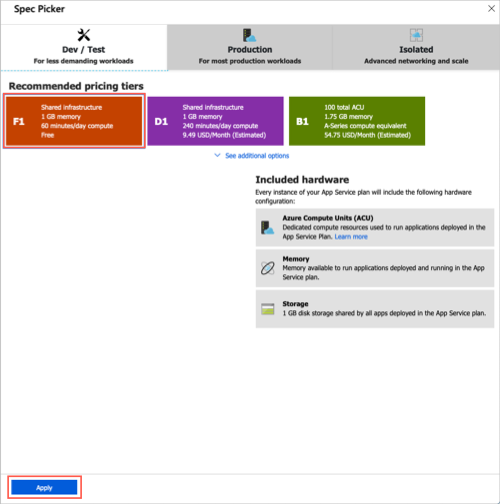

技術プロフェッショナルとしては、特定の地域で専門知識を持っている可能性があります。As a technology professional, you likely have expertise in a specific area. おそらく、ストレージ管理者または仮想化の専門家であるか、最新のセキュリティ対策に焦点を当てているかもしれません。Perhaps you're a storage admin or virtualization expert, or maybe you focus on the latest security practices. 学生の場合でも、興味をお持ちの場合があります。If you're a student, you may still be exploring what interests you most.

ほとんどのユーザーは、自分の役割にかかわらず、web サイトを作成してクラウドを使い始めることになります。No matter your role, most people get started with the cloud by creating a website. ここでは、アプリサービスにホストされている web サイトを展開します。Here you'll deploy a website hosted in an App Service.

ここでは、いくつかの基本的な用語を確認して、最初の web サイトを作成して実行してみましょう。Let's review some basic terms and get your first website up and running.

## アプリサービスとは何ですか?What is an App Service?

Azure App Service は、インフラストラクチャを管理することなく、さまざまな種類の web ベースのソリューションを構築およびホストできるようにする、HTTP ベースのサービスです。Azure App Service is an HTTP-based service that enables you to build and host many types of web-based solutions without managing infrastructure. たとえば、サポートされている複数のプログラミング言語で web アプリ、モバイルバックエンド、RESTful Api をホストできます。For example, you can host web apps, mobile back ends, and RESTful APIs in several supported programming languages. .NET、.NET Core、Java、Ruby、Node .js、PHP、または Python で開発されたアプリケーションは、Windows と Linux ベースの両方の環境で簡単に実行およびスケーリングできます。Applications developed in .NET, .NET Core, Java, Ruby, Node.js, PHP, or Python can run in and scale with ease on both Windows and Linux-based environments.

Web サイトの作成は、昼食にかかる時間よりも短くなります。We aim to create a website in less than the time it takes to eat lunch. そのため、コードを記述する必要はありません。代わりに、Microsoft Azure Marketplace から定義済みのアプリケーションを展開します。Therefore, we're not going to write any code and will instead deploy a predefined application from the Microsoft Azure Marketplace.

## Microsoft Azure Marketplace とは何ですか?What is the Microsoft Azure Marketplace?

Microsoft Azure Marketplace は、Azure で実行するために認定および最適化されたアプリケーションをホストするオンラインストアです。The Microsoft Azure Marketplace is an online store that hosts applications that are certified and optimized to run in Azure. AI + Machine Learning から Web アプリケーションまで、多くの種類のアプリケーションを利用できます。Many types of applications are available, ranging from AI + Machine Learning to Web applications. わずか数分で、ストアからの展開は、ウィザードスタイルのユーザーインターフェイスを使って Azure ポータルで行われます。As you'll see in a couple of minutes, deployments from the store are done via the Azure portal using a wizard-style user interface. このユーザーインターフェイスでは、さまざまなソリューションを簡単に評価できます。This user interface makes evaluating different solutions easy.

ここでは、web サイトの Azure Marketplace の WordPress アプリケーションオプションのいずれかを使用します。We're going to use one of the WordPress application options from the Azure Marketplace for our website.

## Azure でのリソースの作成Creating resources in Azure

通常、最初に行うことは、作成する必要があるすべての項目を格納するための*リソースグループ*を作成することです。Typically, the first thing we'd do is to create a *resource group* to hold all the things that we need to create. [*リソース] グループ*では、サービス、ディスク、ネットワークインターフェイス、および、ソリューションを構成する可能性があるその他の要素を、1つの単位として管理することができます。The *resource group* allows us to administer all the services, disks, network interfaces, and other elements that potentially make up our solution as a unit. Azure portal を使用して、ソリューションのリソースグループの作成と管理を行うことができます。We can use the Azure portal to create and manage our solution's resource groups. ただし、コマンドラインから Azure CLI を使ってリソースを管理することもできますので注意してください。However, keep in mind that you can also manage resources via a command line using the Azure CLI. Azure CLI は、今後のプロセスを自動化する必要がある場合に便利なオプションです。The Azure CLI is a useful option should you need to automate the process in the future.

無料の Azure sandbox 環境では、作成済みのリソースグループ**<rgn>[sandbox リソースグループ名]</rgn>** を使用し、この手順を実行する必要はありません。In the free Azure sandbox environment, you'll use the pre-created resource group **<rgn>[sandbox resource group name]</rgn>**, and you don't need to do this step.

アプリサービスの構成情報が表示された Test1 myamada-2 png ファイルTest1 myamada - 2 png files 

Test2 myamada- [ ![[開発/テスト] セクションが選択されていることを示す、アプリサービスプランの価格帯のパネルと同じ png スクリーンショットが強調表示され、適用が選択されています。](../media/4-select-pricing-tier.png)](../media/4-select-pricing-tier.png#lightbox)Test2 myamada - same png 
